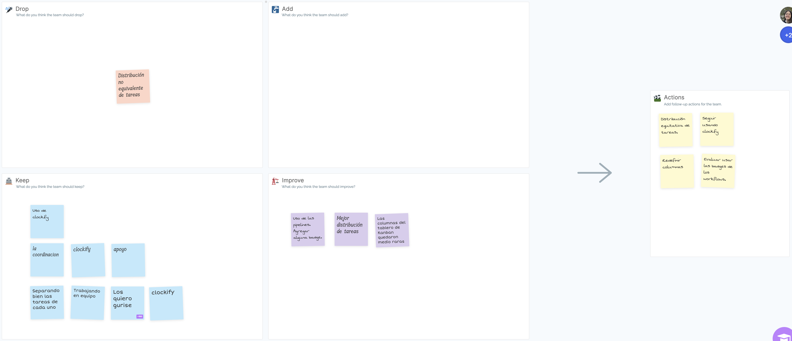

# Retrospectiva

Para realizar la restrospectiva al igual que en la entrega anterior, utilizamos un template de DAKI de metroretro.io.

La ceremonia se encuentra disponible en este [link](https://fi365-my.sharepoint.com/:v:/g/personal/fm251662_fi365_ort_edu_uy/EVxARtn9aUNNo_uWi2VFyeEBvNxNqx9lH8ToYG8MUOsz8Q?nav=eyJyZWZlcnJhbEluZm8iOnsicmVmZXJyYWxBcHAiOiJTdHJlYW1XZWJBcHAiLCJyZWZlcnJhbFZpZXciOiJTaGFyZURpYWxvZyIsInJlZmVycmFsQXBwUGxhdGZvcm0iOiJXZWIiLCJyZWZlcnJhbE1vZGUiOiJ2aWV3In19&e=Efrc2q).

Esta instancia, a diferencia de la anterior, consistió en una primera parte de 8 minutos (ya que estimabamos que 10 minutos era demasiado tiempo), en donde cada uno se concentró en crear notas para cada uno de los distintos aspectos de DAKI. 

Al finalizar el tiempo, se hizo una puesta en común. Luego de esto, se determinaron acciones a llevar a cabo en base a lo discutido.

El tablero resultante de esta retrospectiva es el siguiente:

Como acciones decidimos en primera instancia, tener una distribución equitativa de tareas, para que así todos podamos llegar a tener el mismo esfuerzo invertido. Así como tambien intentar redefinir las columnas del tablero ya que nos dimos cuenta que el flujo de las tareas no quedó muy claro. Por último, evaluaremos si usar o no las badges de los workflows.

Destacamos la importancia de seguir empleando Clockify como herramienta de monitero de horas, y continuar con la motivación y compromiso con el que venimos trabajando en el equipo.