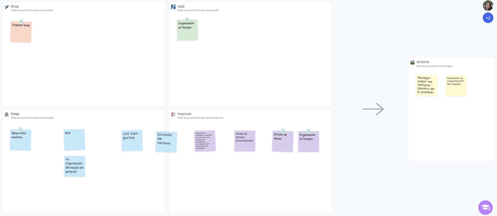

# Retrospectiva

Para realizar la restrospectiva al igual que en la entrega anterior, utilizamos un template de DAKI de metroretro.io.

La ceremonia se encuentra disponible en este [link](https://fi365-my.sharepoint.com/:v:/g/personal/fm251662_fi365_ort_edu_uy/EWjCjiViCrlEsOJ4dmGQKMwB6tKHi1ZVHQ-zxy9psSjxEw?nav=eyJyZWZlcnJhbEluZm8iOnsicmVmZXJyYWxBcHAiOiJTdHJlYW1XZWJBcHAiLCJyZWZlcnJhbFZpZXciOiJTaGFyZURpYWxvZyIsInJlZmVycmFsQXBwUGxhdGZvcm0iOiJXZWIiLCJyZWZlcnJhbE1vZGUiOiJ2aWV3In19&e=lu59Av).

En esta instancia, al igual que en la anterior, consistió en una primera parte de 8 minutos, en donde cada uno se concentró en crear notas para cada uno de los distintos aspectos de DAKI. 

Al finalizar el tiempo, se hizo una puesta en común. Luego de esto, se determinaron acciones a llevar a cabo en base a lo discutido.

El tablero resultante de esta retrospectiva es el siguiente:

Como acciones decidimos en primera instancia, manejar mejor los tiempos, siempre y cuando sea posible (debido a factores externos como otras entregas, trabajo, y demás), y a su vez destacamos mantener la organización del equipo, ya que si bien esta entrega fue un tanto caótica, supimos salir a flote debido al apoyo grupal que venimos formando desde la primera entrega.