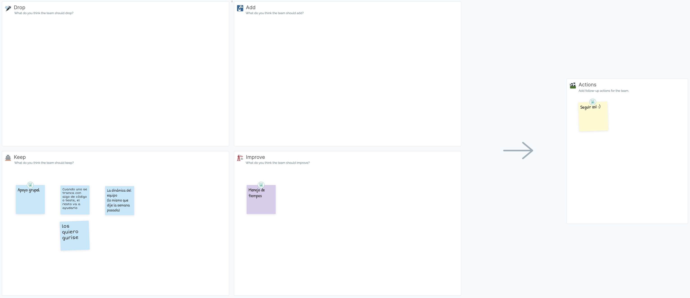

# Retrospectiva

Para realizar la restrospectiva al igual que en la entrega anterior, utilizamos un template de DAKI de metroretro.io.

La ceremonia se encuentra disponible en este [link](https://fi365-my.sharepoint.com/:v:/g/personal/fm251662_fi365_ort_edu_uy/EQaSadwf0eVElmr6n9SfysQBSyZKvEqSNCkMf2gpk-SCMg?nav=eyJyZWZlcnJhbEluZm8iOnsicmVmZXJyYWxBcHAiOiJTdHJlYW1XZWJBcHAiLCJyZWZlcnJhbFZpZXciOiJTaGFyZURpYWxvZyIsInJlZmVycmFsQXBwUGxhdGZvcm0iOiJXZWIiLCJyZWZlcnJhbE1vZGUiOiJ2aWV3In19&e=dk17Je).

En esta instancia, al igual que en la anterior, consistió en una primera parte de 8 minutos, en donde cada uno se concentró en crear notas para cada uno de los distintos aspectos de DAKI. 

Al finalizar el tiempo, se hizo una puesta en común. Luego de esto, se determinaron acciones a llevar a cabo en base a lo discutido.

El tablero resultante de esta retrospectiva es el siguiente:

Como acciones decidimos continuar de la misma forma en la que venimos trabajando hasta ahora. Al pasar las entregas fuimos limando detalles y mejorando la forma de trabajo, y por ende no nos sorprende que no tengamos nuevos caminos que tomar.